# Fake_OCR
3학년 2학기 '영상처리프로그래밍' 기말 프로젝트
(**컴퓨터비전, 인공지능을 사용하지 않고** 영상처리 기술만 사용하는 프로젝트)

# <소개>
  - Python Opencv 사용
  - 사진 속의 텍스트를 추출하는 인공지능 **OCR(Optical Character Recognition)** 모티브
  - Opnecv의 이진화(binarization), 컨투어(contour), 비트연산(bitwise) 활용
  - 사전에 글자의 라이브러리 제작 (해당 프로젝트에서는 한 종류의 폰트로만 제작)
  - 실행 시 사진 속의 글자의 영역별로 라이브러리 비교 후 가장 유사한 글자 매칭 
  
  ## 글자 라이브러리
   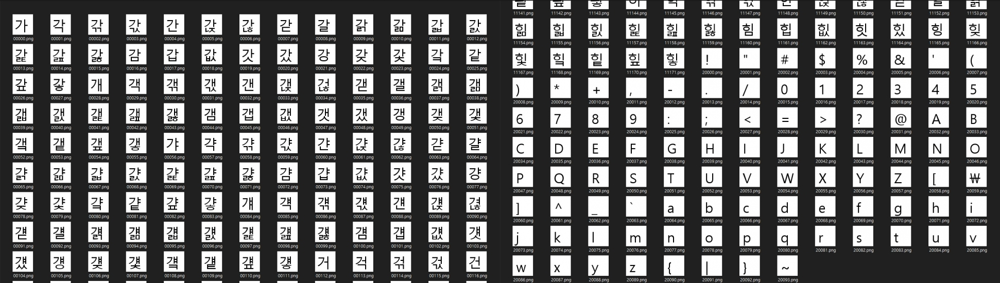
   
   - 유니코드의 번호를 이용해서 한 문자씩 출력하여 라이브러리에 저장
   - 한글의 유니코드의 범위는 0xAC00 부터 0xD79F 까지 총 11172개 (0번대 ~ 1만번대로 설정)
   - ! , " ? @ 같은 문자와 영어 대소문자의 범위는 0x0021 부터 0x007E 까지 총 94개(2만번대로 설정)
   - 반복문을 사용하여 글꼴만 지정하면 라이브러리 자동 생성
   - 텍스트를 이미지화 하기 위해 Opencv 이미지를 ImagePIL 변경 후 텍스트 출력 후 다시 Opencv 이미지로 변환
    
  ## OCR
   #### 한 글자씩 라이브러리와 비교 시 컨투어를 좌표들을 roi영역을 지정후 크기를 동일하게 조정후 bitwise_xor연산을 사용
   
   - xor 연산은 값이 같을 때 0을 출력, 이미지에 적용하면 특정 픽셀 위치의 값이 같으면 0(검은색)이고 다르면 흰색.
   - 흰색의 면적이 적을수록 이미지가 서로 유사함. 
   - (전체 면적에 흰색이 차지하는 비율을 사용해서 값이 낮은 제일 유사한 이미지를 식별)
  
   #### 프로그램 순서
   
   #### 초기
   
   
   
   ##### - 사진속의 도형 하나씩 컨투어를 이용하여 영역을 정하기 (함수 : choose_file()의 contour 객체)
      
   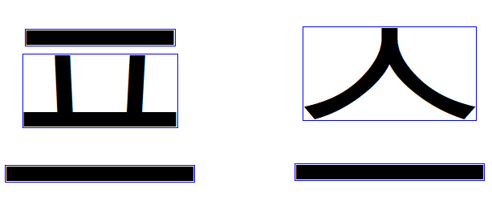
   
   ##### - 영역이 겹치거나 매우 근접할때 한 글자로 인식해서 영역 합치기 (함수 : combine_Texts():)
   
   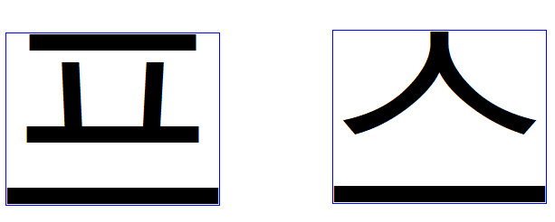
   
   ##### - 합친 도형(한 글자)의 순서를 왼쪽에서 아래로 글 읽는 순서처럼 정렬하기 (함수 : sort_Texts())
   ##### - 정렬 후 한 글자씩 라이브러리의 파일들을 이용하여 비교하기 (함수 : check_Texts())
   
   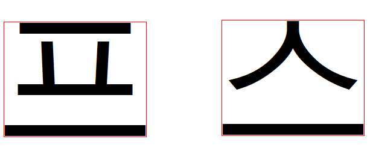
   
   ##### - 결과 출력 ()
   
   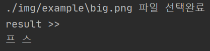

   
  ## 결과
   #### sample1 (한글1)
   
   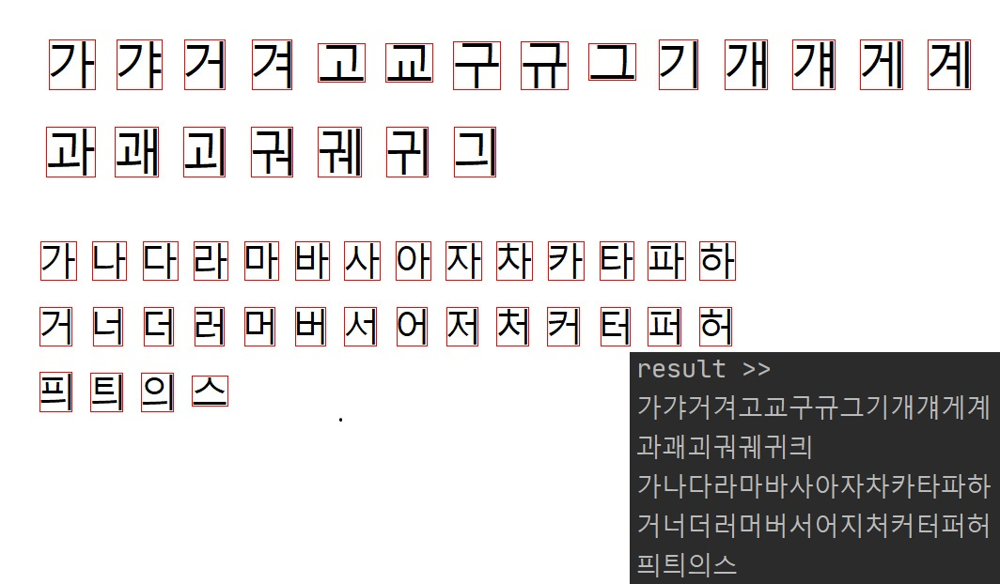
   
   #### sample2 (한글2)
   
   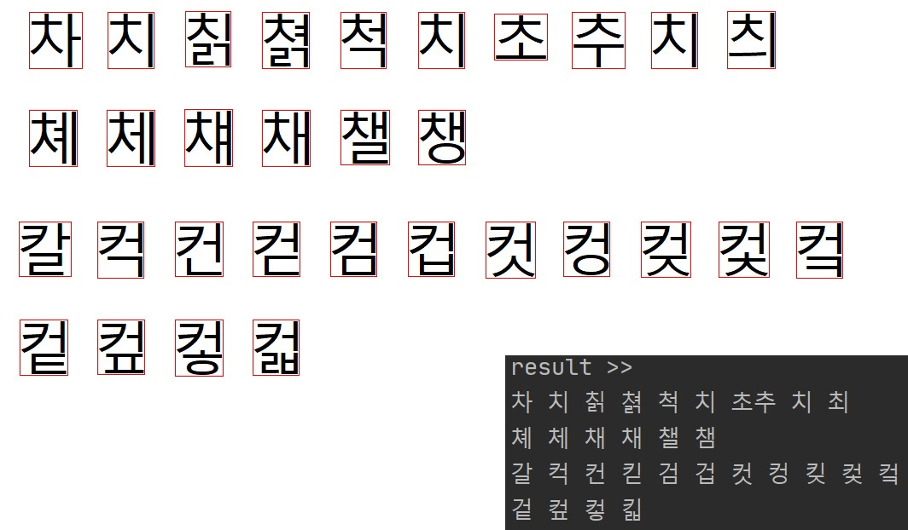
   
   #### sample3 (영어)
   
   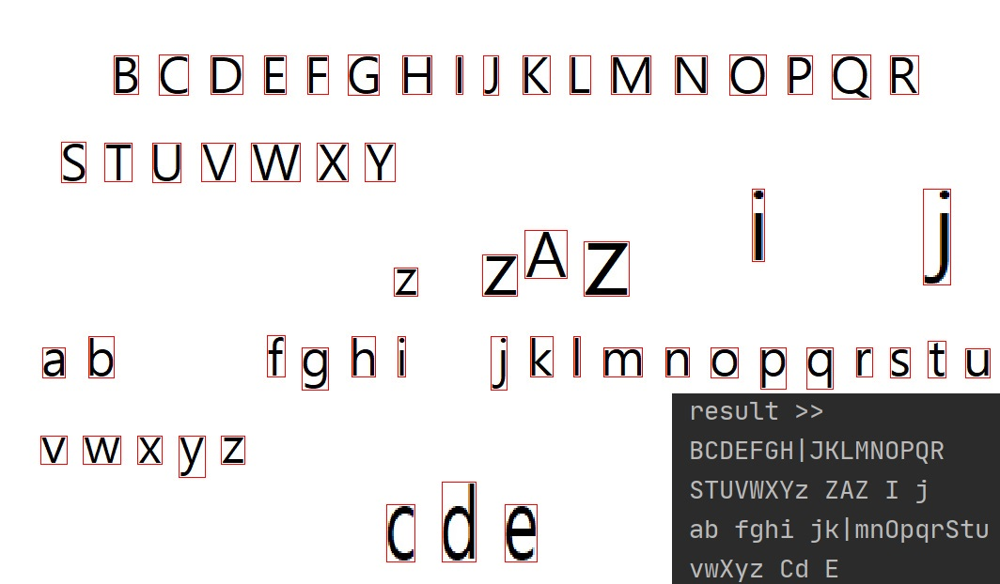
   
   #### sample4 (혼합)
   
   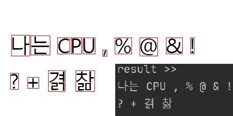
   
   #### sample5 (글자의 비율을 조정)
   
   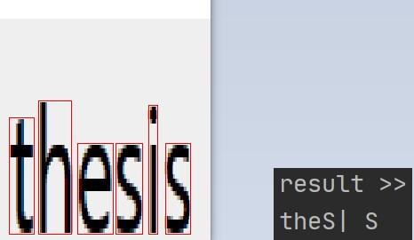
   
   - 인식률 저하
   
   #### sample6 (다른 폰트 사용)
   
   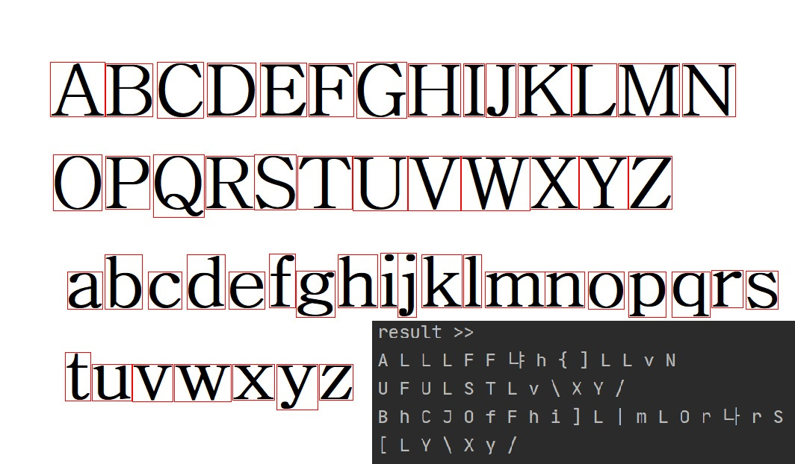
   
   - 인식률 저하
  
  
  ## 한계
   - 컴퓨터비전, 인공지능 사용없이 자동적으로 영역을 나누기 어려움
   - 몇몇 폰트는 소문자 알파벳l 과 대문자 알파벳I를 구별하기 힘듬
   - 글자의 비율을 좁히거나 늘리면 구별이 힘듬
   - 폰트의 갯수가 어느정도 되야 실사용 가능 (하지만 라이브러리 용량이 커지면 속도가 느려짐)

  ## 어려웠던점
   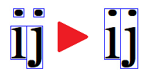
   
   - 소문자 i j 같이 연결되어 있지 않는 문자들 처리의 어려움 >> 공백크기를 사용자가 지정함으로 문제 해결
  
## <개발환경>
- IDE : Jupyter Notebook, PyCharm
- Hardware : AMD RYZEN 2200G(4core) RAM 8GB

## <개발기간>
- 2021년 12월(1주)
